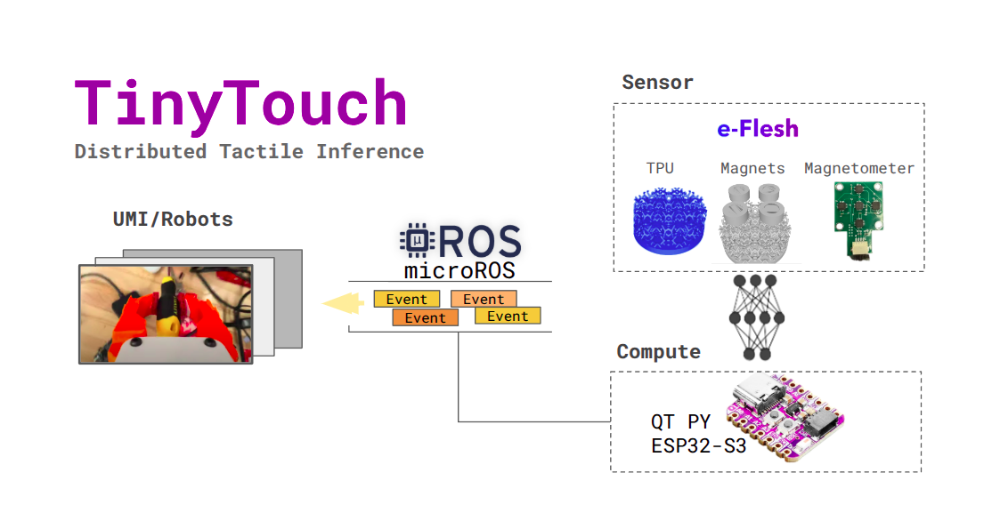

# TinyTouch
### Distributed Tactile Inference for Robotic Manipulation



TinyTouch is a low-cost tactile sensing system built around magnetic Hall-effect sensors. It reads 3-axis magnetic field data from an array of sensors, classifies touch events (contact, slip, tap) using a quantized CNN, and publishes results over serial or ROS 2.

---

## Hardware

| Part | Role |
|------|------|
| Adafruit QT Py ESP32-S3 | Microcontroller |
| 2× eFlesh boards | Sensor carrier (5× MLX90393 each) |
| PCA9546A I2C mux | Routes boards on a single bus |

10 MLX90393 3-axis magnetometers total, arranged across two eFlesh boards connected via STEMMA QT.

---

## Firmware

Open `firmware.ino/firmware.ino.ino` in Arduino IDE. Select one mode at the top of the file:

```cpp
#define MODE_SERIAL    // binary frames over USB → collect.py / tinytouch.py
// #define MODE_MICROROS  // publishes /tinytouch/raw as Float32MultiArray
```

Flash to an Adafruit QT Py ESP32-S3 (board: `Adafruit QT Py ESP32-S3`).

**microROS mode** requires the `micro_ros_arduino` library and a running agent on the host:
```bash
docker run -it --rm -v /dev:/dev --privileged --net=host \
  microros/micro-ros-agent:jazzy serial --dev /dev/ttyACM0 -b 115200
```

---

## Python Setup

Requires Python ≥ 3.10 and [uv](https://docs.astral.sh/uv/).

```bash
git clone <repo>
cd TinyTouch
uv sync
```

---

## Workflow

### 1. Calibrate
Captures peak field strength for normalization:
```bash
uv run calibration.py /dev/ttyACM0
```
Saves a `calibration/calib_<timestamp>.yaml` file.

### 2. Collect data
Label and record touch episodes interactively:
```bash
uv run collect.py /dev/ttyACM0
```
Keys: `i` idle · `m` contact make · `b` contact break · `s` slip · `t` tap · `q` export & quit

### 3. Train
Open `train.ipynb` to run the full training pipeline:
- FP32 baseline → INT8 PTQ → INT8 QAT → INT8 pruned
- Exports `.tflite` models to `models/`

### 4. Run inference
```bash
uv run probe.py /dev/ttyACM0
```

### 5. ROS 2 bridge (optional)
Bridges serial frames to `/tinytouch/raw` without flashing microROS firmware:
```bash
source /opt/ros/$ROS_DISTRO/setup.bash
python3 ros_bridge.py /dev/ttyACM0
```

---

## Touch Classes

`idle` · `contact_make` · `contact_break` · `slip` · `tap`

---

## Model targets

- ≥ 92% slip detection accuracy  
- < 500 KB flash / < 100 KB RAM  
- < 10 ms sense → publish latency
